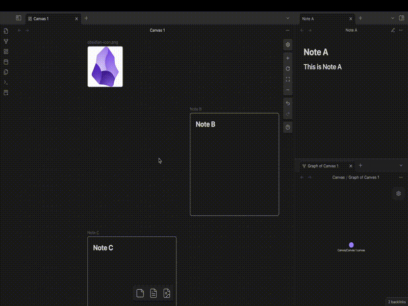
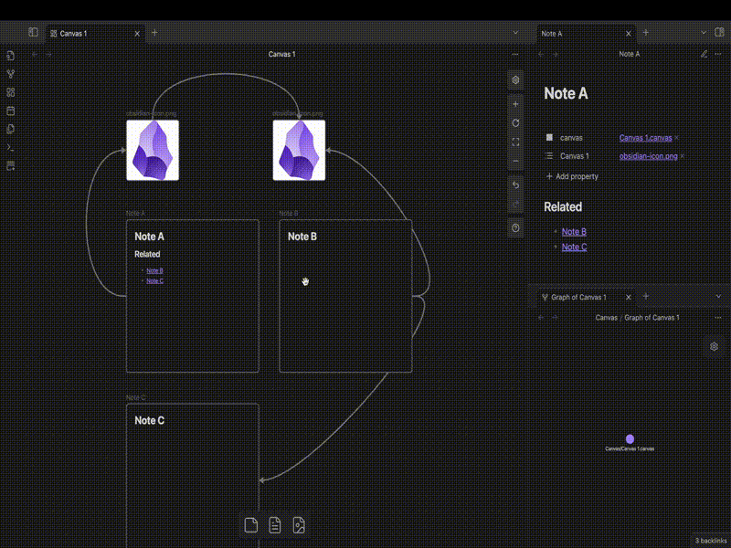

# Obsidian - Enhanced Canvas
## Overview

This Obsidian plugin enhances Canvas functionality by automatically managing node connections and synchronizing them with note properties. 

When you edit in Canvas, the plugin automatically tracks relationships by adding properties named after the canvas file to your notes. 

Most importantly, creating edges in Canvas establishes connections visible in the Graph View through markdown links.

- Based on this demo:
  1. When a node is added to the canvas, it generates a 'canvas' property with a link to its corresponding canvas file. Upon clicking this link from a note, the system automatically focuses and zooms to the associated node in the canvas.
  2. Similarly, creating an edge in the Canvas generates a 'Canvas 1' property with a link to the target note, where the property name is derived from the canvas file name without its '.canvas' extension.
  3. When remove note from the canvas, all the property related to the canvas file will be removed.

Note: The property icon for 'canvas' is customized using the "File Property Enhancer" plugin.

## Key Features

- **Automated Property Synchronization**
  - Automatically creates properties in source notes when connecting nodes in Canvas
  - Properties are named after the canvas file to track relationships
  - Supports file nodes, nested Canvas files (.canvas), images, PDFs, and any content that can be represented as markdown links
  - Note: Text nodes (cards) are not supported as they cannot be represented as markdown links
- **Shortest Path Optimization** for node connections
- **Bidirectional Link Management** between Canvas and note content

## Command Features

**"Auto Connect Nodes and Adjust Edge with Shortest Path"**
- Automatically establishes connections based on existing markdown links in notes
- Optimizes edge paths in Canvas for minimal distance
- Supports all node types (text nodes, group nodes, images, nested Canvases, etc.)

## Other Use Cases

### 1. Canvas File Opening
When opening a Canvas file:
- Automatically updates canvas-specific properties for all file nodes
- Property names are generated based on the canvas filename
- Enables easy property synchronization through simple file opening

### 2. Canvas File Deletion
When deleting a Canvas file:
- Automatically removes associated canvas-specific properties from all notes
- Cleans up all properties named after the deleted canvas

### 3. Canvas File Renaming
When renaming a Canvas file:
- Automatically updates property names in all associated notes
- Renames properties to match the new canvas filename
- Preserves all existing relationships under the new property name

## Manual Installation Steps

### 1. Create Plugin Directory
- Create a new folder in your plugins directory: `<vault>/.obsidian/plugins/`
  (where `<vault>` is your Obsidian vault root directory)
- Complete path example: `<vault>/.obsidian/plugins/obsidian-enhanced-canvas/`

### 2. Download Required Files
Download the following files from the plugin's GitHub Release page and place them in the newly created folder:

Required files:
- `main.js` - Main plugin code
- `manifest.json` - Plugin configuration file
Optional file:
- `styles.css` - Custom stylesheet

### 3. Restart Obsidian
- Close and reopen Obsidian

### 4. Enable the Plugin
- Open Settings
- Navigate to Community plugins
- Locate the installed plugin in the list
- Toggle the switch to enable the plugin

## Notes

### Source files
- You can obtain the plugin files through either:
  	- Download from the plugin's GitHub Release page
	- Build from source: Clone the repository and compile it yourself
		- `npm i` (Node.js and npm are prerequisites)
		- `npm run dev`

### Property icons

- Using the "File Property Enhancer" plugin to edit property icons will make the properties in "Enhanced Canvas" look better.

## Contributing

All contributions are welcome! 

## Say Thank You
If you are enjoying Enhanced Canvas, then please support my work and enthusiasm by buying me a coffee on https://buymeacoffee.com/robertttbs.
