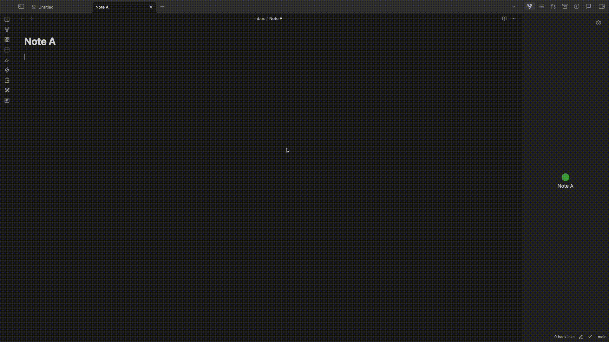
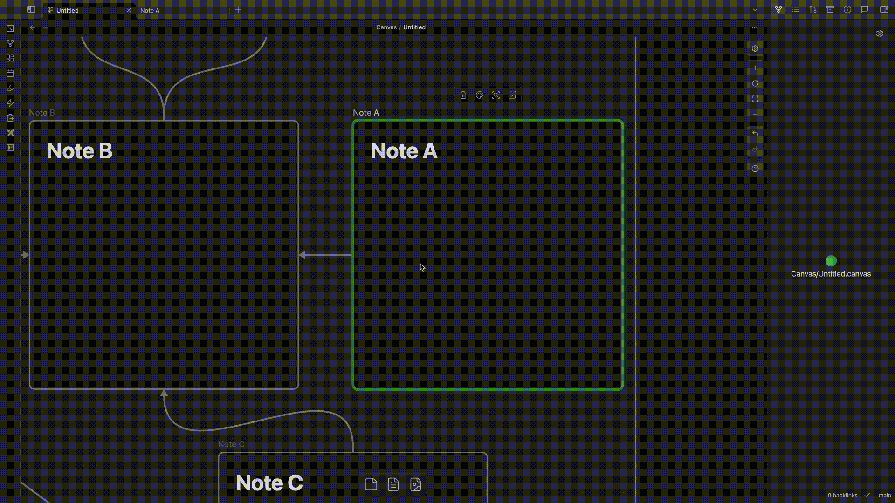
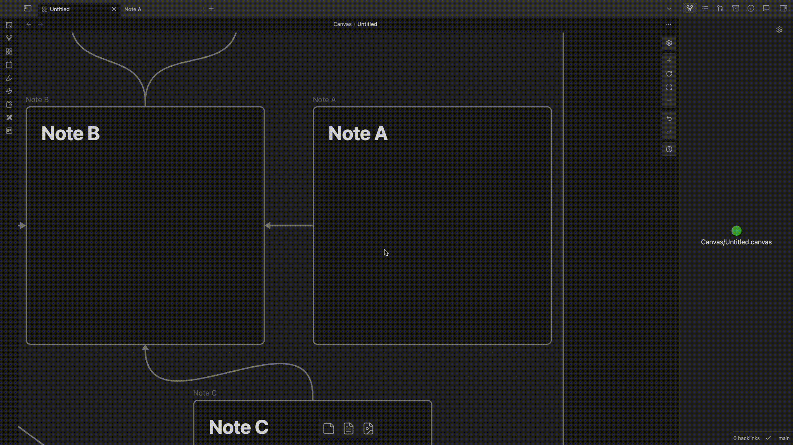
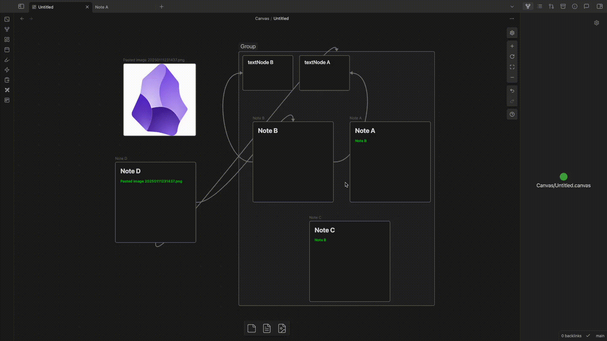

# Obsidian - Enhanced Canvas
# Overview

This Obsidian plugin manages node connections in Canvas and automatically synchronizes them with the `related` property in notes. It streamlines the visualization and maintenance of document relationships within your notes and Canvas.

**The most exciting thing is that creating edges in canvas results in the Graph View connection due to the establishment of the markdown link.**

# Key Features

- **Automated Frontmatter Synchronization** of `related` fields in properties.
- **Shortest Path Optimization** for node connections
- **Bidirectional Link Management** between Canvas and markdown content

# Command Features

- Command: **"Auto Connect Nodes and Adjust Edge with Shortest Path"**
    - Automatically establishes connections based on markdown links in the notes.
    - Optimizes existing edges (links, connections) in Canvas for shortest paths.
	    - Supports all kinds of nodes (text nodes, group nodes, etc.).

# Use Case 1: Creating Edge in Canvas

When connecting NoteA to NoteB in Canvas:
- Automatically updates NoteA's `related` property with a link to NoteB
- Preserves existing markdown links in Note A's content to prevent duplicate links.
- Handles image nodes

# Use Case 2: Deleting Edge in Canvas

When removing a Canvas edge (link):
- Automatically removes corresponding `related` property from source note's frontmatter
- Preserves existing markdown links within note content

# Use Case 3: Updating Edges in Canvas

When updating edge destination endpoints:
- Automatically synchronizes the source node's `related` property
- Ensures bidirectional consistency between Canvas visual representations and markdown-linked `related` properties

# Use Case 4: Canvas Command

- Provides a command "Auto connect nodes and adjust edges with shortest path"
- When multiple nodes are selected, this command will:
    - If there are edges between the selected nodes:
        - Optimize edges to create the shortest path, as existing connections may no longer be optimal after nodes are moved
    - Automatically create Canvas edges (links) between nodes that have Markdown link relationships

## Manual Installation Steps

### 1. Create Plugin Directory
- Create a new folder in your plugins directory: `<vault>/.obsidian/plugins/`
  (where `<vault>` is your Obsidian vault root directory)
- Complete path example: `<vault>/.obsidian/plugins/obsidian-enhanced-canvas/`

### 2. Download Required Files
Download the following files from the plugin's GitHub Release page and place them in the newly created folder:

Required files:
- `main.js` - Main plugin code
- `manifest.json` - Plugin configuration file
Optional file:
- `styles.css` - Custom stylesheet

### 3. Restart Obsidian
- Close and reopen Obsidian

### 4. Enable the Plugin
- Open Settings
- Navigate to Community plugins
- Locate the installed plugin in the list
- Toggle the switch to enable the plugin

### Notes
- You can obtain the plugin files through either:
  	- Download from the plugin's GitHub Release page
	- Build from source: Clone the repository and compile it yourself
		- `npm i` (Node.js and npm are prerequisites)
		- `npm run dev`

# Contributing

All contributions are welcome! 

# Say Thank You
If you are enjoying Enhanced Canvas, then please support my work and enthusiasm by buying me a coffee on https://buymeacoffee.com/robertttbs.
