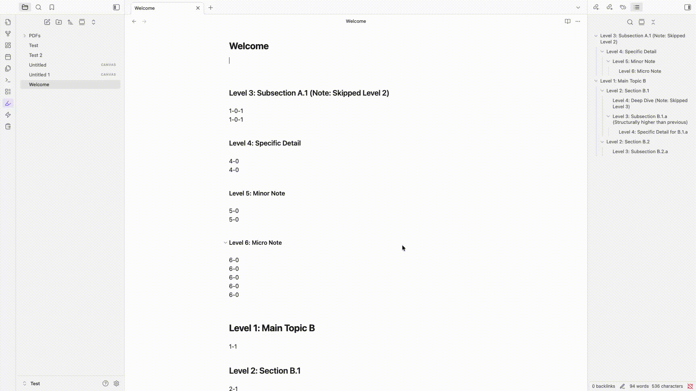
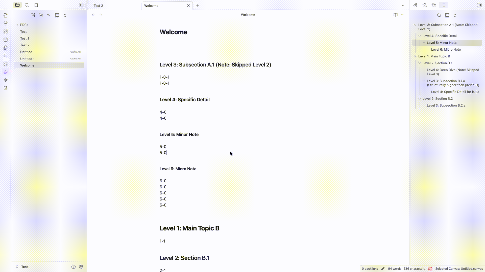
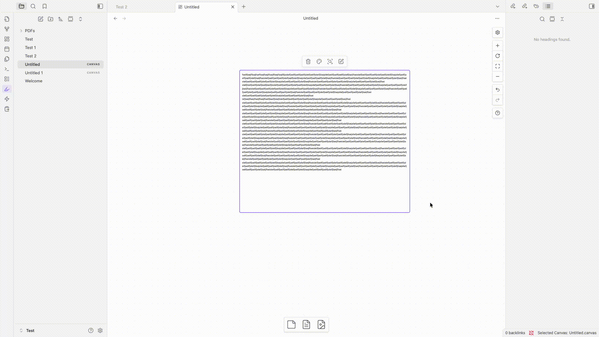
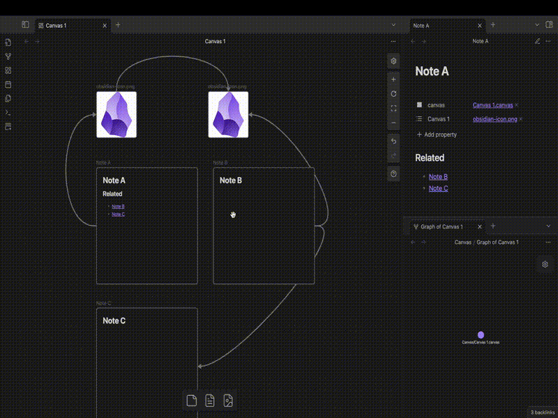

# Enhanced Canvas

> This Obsidian plugin enhances Obsidian Canvas with features I find essential.

## ✨New Feature✨

### Split Node by Headings

**Split Node by Headings** instantly deconstructs a single node into a hierarchical tree based on its headings. You can try this by right-clicking on a file (text) node and selecting "Split by Headings" in Canvas.



### Send Note to Canvas

With the **"Send to Canvas"** command, you can push your current markdown note directly to a specific Canvas. It automatically appends a "canvas" property to your note, allowing you to navigate back to the board instantly in the future.

Once you have sent a note, that Canvas becomes the "Selected." You can then use the **"Send to Selected Canvas"** command on other notes to instantly add them to the same board—bypassing the file selection step entirely.



### Auto-Resize Node

With this update, double-clicking the bottom edge engages **"Auto-Resize."** Now, when you drag the right edge to adjust the width or update the text, the height dynamically adjusts to fit your text. No need for repeated double-clicking!

Dragging the bottom edge to manually adjust the height disables the node's auto-resize feature.



## Main Feature


Based on this demo:

1. **Node addition**: When a note is added to the canvas, the plugin generates a 'canvas' property with a link to its corresponding canvas file.

2. **Edge addition**: Creating an edge in the Canvas generates a link to the target note within a property named after the canvas file (e.g., 'Canvas 1'), where the property name is derived from the canvas file name without its '.canvas' extension.

3. **Node Focusing**: Upon clicking a link to a .canvas file from a note, the system automatically focuses and zooms to the associated node in the canvas.

**Note 1**: All Canvas-related properties will be added when this plugin is enabled, and all properties added by this plugin will be removed upon disabling it.

**Note 2**: If you delete or rename a .canvas or Markdown file, all associated properties will also be updated.

### Hide The Frontmatter by Default

> In version after 1.0.12, the frontmatter (properties) in Canvas nodes is hidden by default.

> To view or edit properties in a Canvas node, comment out or remove the code below in `.obsidian/plugins/obsidian-enhanced-canvas/style.css`.

```
.markdown-embed .metadata-container,
.markdown-embed-content .metadata-container {
display: none !important;
}

.mod-inside-iframe.is-live-preview .metadata-container {
display: none !important;
}
```

## Commands

-   **Adjust edges with shortest path**

    -   Adjusts edges between selected nodes using shortest path

-   **Delete edges between selected nodes**

    -   Removes all edges between selected nodes

-   **Add edges according the links in notes**

    -   Automatically creates edges between selected nodes based on links within notes

-   **Remove the property of all nodes in current Canvas**
    -   Removes properties from all nodes in the current Canvas

### Demo

-   **Add edges according the links in notes**



-   Automatically establishes connections based on existing markdown links in notes

-   It integrates **Adjust edges with shortest path**

-   Optimizes edge paths in Canvas for minimal distance

-   Supports all node types (text nodes, group nodes, images, nested Canvases, etc.)

## Installation Steps

Search for "Enhanced Canvas" in the community plugins and install it. Once enabled, it automatically adds all properties to existing .canvas files.

## Contributing

All contributions are welcome!

## Say Thank You

If you are enjoying Enhanced Canvas, then please support my work and enthusiasm by buying me a coffee on https://buymeacoffee.com/robertttbs.
