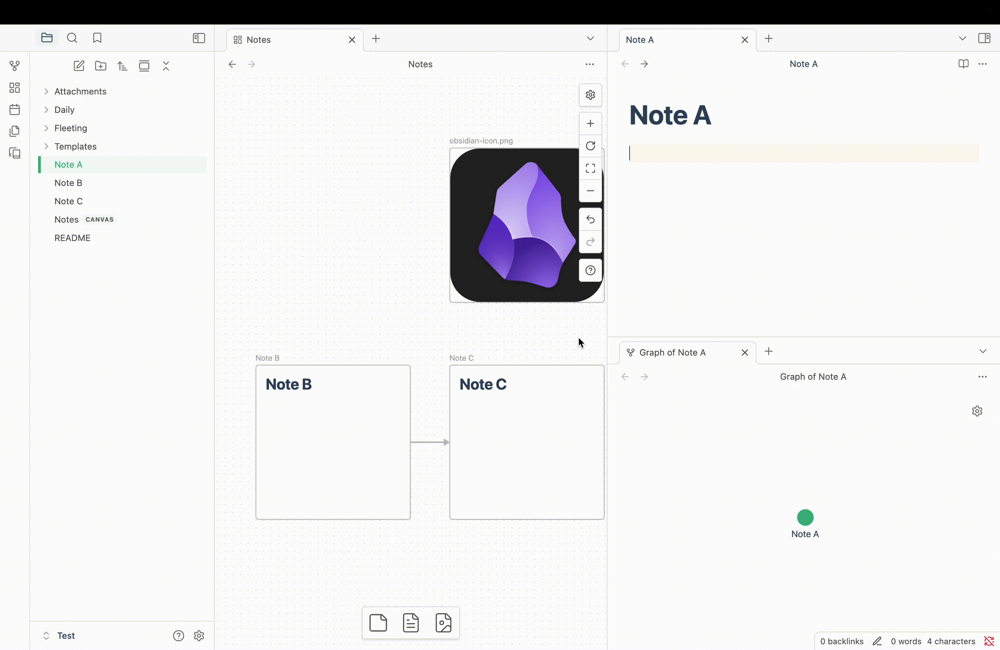
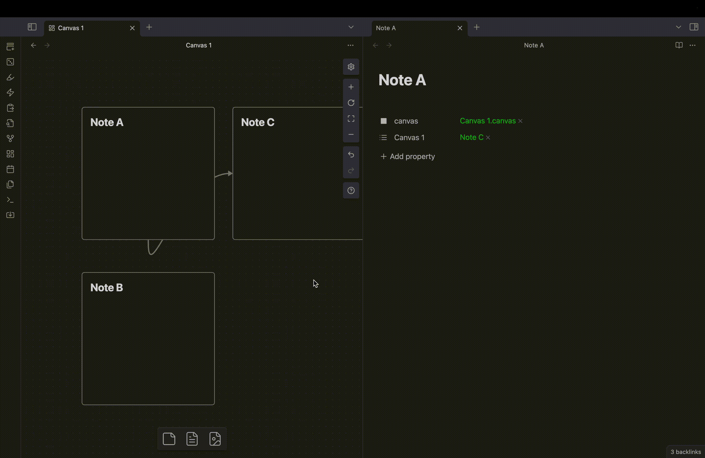

# Enhanced Canvas

>Designed for heavy user of Obsidian Canvas.

## Overview

This Obsidian plugin enhances Canvas functionality by automatically managing node connections and synchronizing them with note properties.

When you edit in Canvas, the plugin automatically tracks relationships by adding properties named after the canvas file to your notes.

Most importantly, creating edges in Canvas establishes connections visible in the Graph View through markdown links.

## Demo

- Based on this demo:
  1. **Node addition**: When a note is added to the canvas, the plugin generates a 'canvas' property with a link to its corresponding canvas file.
  2. **Edge addition**: Creating an edge in the Canvas generates a link to the target note within a property named after the canvas file (e.g., 'Canvas 1'), where the property name is derived from the canvas file name without its '.canvas' extension.
  3. **Node deletion**: When a note is removed from the canvas, all properties related to that canvas file will be removed.

**Note 1**: All Canvas-related properties will be added when this plugin is enabled, and all properties added by this plugin will be removed upon disabling it.

**Note 2**: This plugin tracks changes to .canvas files and can synchronize note properties when the name of a .canvas file changes.

**Note 3**: Upon clicking a link to a .canvas file from a note, the system automatically focuses and zooms to the associated node in the canvas.

## Key Features

- **Automated Property Synchronization**
  - Automatically creates properties in source notes when connecting nodes in Canvas
  - Properties are named after the canvas file to track relationships
  - Supports file nodes, nested Canvas files (.canvas), images, PDFs, and any content that can be represented as markdown links
  - Note: Text nodes (cards) are not supported as they cannot be represented as markdown links
- **Shortest Path Optimization** for node connections
- **Bidirectional Link Management** between Canvas and note content

## Command Features

**"Auto Connect Nodes and Adjust Edge with Shortest Path"**
- Automatically establishes connections based on existing markdown links in notes
- Optimizes edge paths in Canvas for minimal distance
- Supports all node types (text nodes, group nodes, images, nested Canvases, etc.)

## Manual Installation Steps

### 1. Create Plugin Directory
- Create a new folder in your plugins directory: `<vault>/.obsidian/plugins/`
  (where `<vault>` is your Obsidian vault root directory)
- Complete path example: `<vault>/.obsidian/plugins/obsidian-enhanced-canvas/`

### 2. Download Required Files
Download the following files from the plugin's GitHub Release page and place them in the newly created folder:

Required files:
- `main.js` - Main plugin code
- `manifest.json` - Plugin configuration file

### 3. Restart Obsidian
- Close and reopen Obsidian

### 4. Enable the Plugin
- Open Settings
- Navigate to Community plugins
- Locate the installed plugin in the list
- Toggle the switch to enable the plugin

## Contributing

All contributions are welcome! 

## Say Thank You
If you are enjoying Enhanced Canvas, then please support my work and enthusiasm by buying me a coffee on https://buymeacoffee.com/robertttbs.
